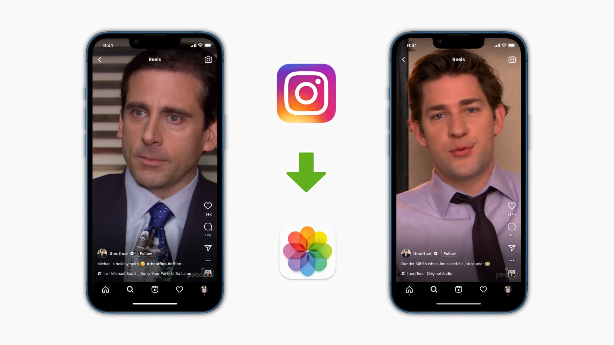

Flutter Reels App Like Instagram 

Here are the plugins used:
1. flutter_cache_manager
2. video_player

   Here you cache videos according to your business logic. Then play reels whenever you need to.
   Also, you can set cache configuration like how many reels you want to cache and their lifespan.
